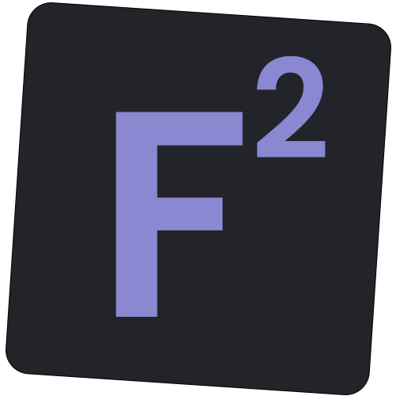

[![Issues][issues-shield]][issues-url]

<!-- PROJECT LOGO -->
 

  

  <h3 align="center">FTN Formule</h3>

  

    Challange yourself with math formulas for FTN
     
    <a href="https://zoksss.github.io/ftn-formule/">View Demo</a>
    ·
    <a href="https://github.com/Zoksss/ftn-formule/issues">Report Bug</a>
  

<!-- ABOUT THE PROJECT -->
## About The Project
FTN Formule is simple learning quiz app. It is made for students learning math formulas, especially ones toward FTN University in Novi Sad, Serbia. It is build with React along with React.Spring for animations. SCSS is used for compact styling.
[![Product Name Screen Shot][product-screenshot]](https://github.com/Zoksss/ftn-formule)

### Built With

*Front End*

* [React](https://reactjs.org/)
* [React Spring](https://react-spring.dev/)

<!-- USAGE EXAMPLES -->

<!-- MARKDOWN LINKS & IMAGES -->
<!-- https://www.markdownguide.org/basic-syntax/#reference-style-links -->
[product-screenshot]: ./src/ftnformule_screenshot.png
